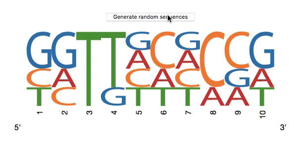

# Sequence Logo Generation

This project implements sequence logo generation using d3, given input data in list form. [Wikipedia](http://en.wikipedia.org/wiki/Sequence_logo) gives a good overview of sequence logos.

## Usage

Open `index.html` from Chrome/Firefox. 

## Style

We adopted the [Airbnb style guide](https://github.com/airbnb/javascript) for Javascript, and [JSDoc format](http://usejsdoc.org/) for our function comments. The code was run through the [ESLint](http://eslint.org/) JS linter.

## Design decisions

Due to the demo nature of this project, various design decisions were made that may need to be reconsidered if this application were to be deployed in production. 

### Accepted input data format

This application hardcodes sequence data in the form of a list of strings, for easy processing. In a real application setting, we would probably want to provide a thorough parser for the FASTA format, and provide useful error reporting to the end-user if their data does not conform to our specifications. This kind of thing (input validation) would ideally be performed server-side rather than client-side.

### Size of accepted sequence data

Because this is a demo project, we limited the length and number of sequences in the data that our application allows (see `index.html`). This is not because the application will break if the sequence data is outside this range, but rather because the quality of visualization will be impacted. For instance, it would be impossible to visualize in a single browser window sequences with length in hundreds or thousands--at that point the visualization would cease to be useful.

How to bound the range of data that this visualization application accepts is not immediate and we may need to investigate usage patterns and end-user needs before deciding on a final solution.

We also placed the restriction that all sequences must be of identical length. If it is desired that sequences may be of varying lengths, this would be an easy change to make.

### Error reporting

Because the application provides its own data, there is very limited error handling. Ideally, all functions which are exposed by `sequence_logo.js` would have their inputs validated and provide useful debugging information.

### Note on letters

So that transforms can be easily applied, I produced predefined SVG path data for the letters 'G', 'C', 'A', and 'T' in a design program and exported them. This created some challenges, because letter paths do not generally have the same width in fonts, whether or not they are monospace. For instance, even in a monospace font, the letter 'T' is more narrow than the letter 'A' and this is compensated for by padding with whitespace--we can't do this easily as part of the SVG path information, to my knowledge. To remedy this situation I wound up applying a lot of predefined transforms to the letters to get them to render as desired. This is an unsatisfying solution, unfortunately.

## Contact

splichte@gmail.com
